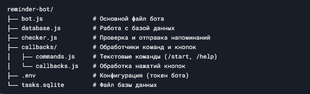
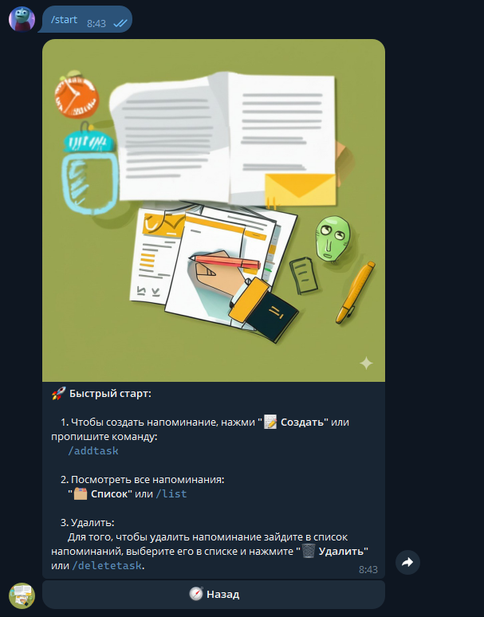
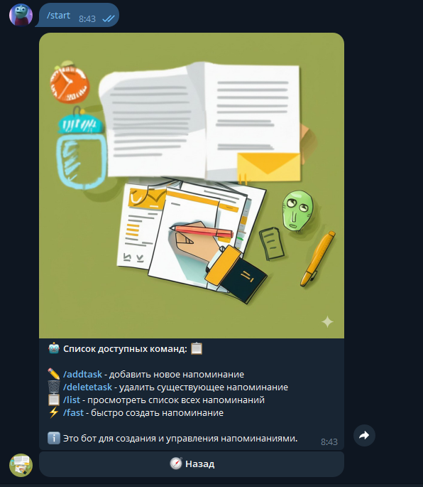
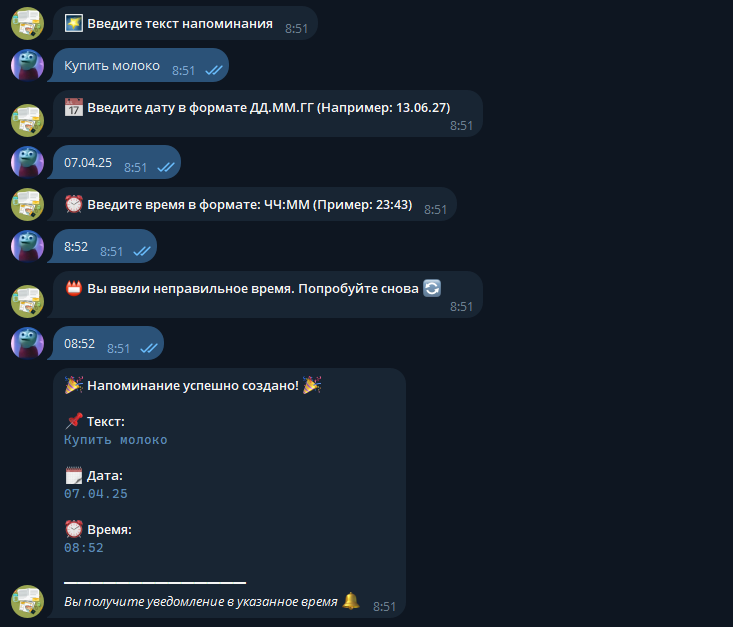
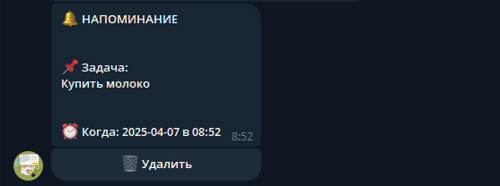
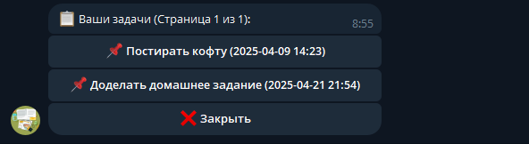

# Проект: "Telegram-бот для напоминаний"

## Оглавление
1. [Введение](#введение)
2. [Цель проекта](#цель-проекта)
3. [Описание функционала](#описание-функционала)
4. [Технологии](#технологии)
5. [Архитектура](#архитектура)
6. [Инструкция по установке](#инструкция-по-установке)
7. [Примеры использования](#примеры-использования)
8. [Заключение](#заключение)
9. [Приложения](#приложения)

---

## Введение
В современном мире с его быстрым ритмом жизни важно не забывать о запланированных делах. Мой проект - это Telegram-бот для создания и управления напоминаниями, который помогает пользователям организовать свое время.

Бот написан на JavaScript с использованием библиотеки Telegraf.js и базы данных SQLite3. Он позволяет:
- Создавать напоминания с указанием точного времени
- Просматривать список всех напоминаний
- Получать уведомления в указанное время
- Управлять напоминаниями через удобное меню

---

## Цель проекта
Разработать удобного и функционального Telegram-бота для управления персональными напоминаниями, который:
1. Будет прост в использовании
2. Имеет интуитивно понятный интерфейс
3. Надежно хранит данные пользователей
4. Точно отправляет напоминания в указанное время

---

## Описание функционала
### Основные функции:
1. **Создание напоминаний** через диалоговый интерфейс
   - Ввод текста напоминания
   - Указание даты и времени
   - Проверка корректности введенных данных

2. **Просмотр списка напоминаний**
   - Пагинация (постраничный вывод)
   - Удобное представление в виде кнопок

3. **Автоматические уведомления**
   - Точная отправка в указанное время
   - Возможность быстрого удаления напоминания

4. **Дополнительные возможности**
   - Главное меню с быстрым доступом к функциям
   - Справка и инструкции
   - Обратная связь с разработчиком

---

## Технологии
1. **Язык программирования**: JavaScript (Node.js)
2. **Библиотеки**:
   - Telegraf - для работы с Telegram API
   - sqlite3 - для работы с базой данных
   - dotenv - для управления переменными окружения
3. **База данных**: SQLite (легковесная файловая БД)
4. **Система контроля версий**: Git
5. **Платформа**: Node.js (серверная среда выполнения)

---

## Архитектура
Проект имеет модульную структуру:

```
reminder-bot/
├── bot.js              # Основной файл бота
├── database.js         # Работа с базой данных
├── checker.js          # Проверка и отправка напоминаний
├── callbacks/          # Обработчики команд и кнопок
│   ├── commands.js     # Текстовые команды (/start, /help)
│   └── callbacks.js    # Обработка нажатий кнопок
├── .env                # Конфигурация (токен бота)
└── tasks.sqlite        # Файл базы данных
```

---

## Инструкция по установке
### Требования:
- Установленный Node.js (версия 14 или выше)
- Аккаунт Telegram
- Бот, созданный через @BotFather

### Шаги установки:
1. Клонировать репозиторий:
   ```bash
   git clone https://github.com/ваш-аккаунт/reminder-bot.git
   cd reminder-bot
   ```

2. Установить зависимости:
   ```bash
   npm install
   ```

3. Создать файл `.env` и добавить токен бота:
   ```
   TOKEN=ваш_токен_бота
   ```

4. Запустить бота:
   ```bash
   node bot.js
   ```

---

## Примеры использования
1. **Стартовое меню**  
   Пользователь отправляет команду `/start` и получает приветственное сообщение с кнопками управления.

2. **Создание напоминания**  
   Пользователь нажимает "📝 Создать" и проходит простой диалог:
   ```
   Бот: Введите текст напоминания
   Пользователь: Сделать домашку по математике
   Бот: Введите дату (ДД.ММ.ГГ)
   Пользователь: 15.05.24
   Бот: Введите время (ЧЧ:ММ)
   Пользователь: 18:30
   Бот: Напоминание создано!
   ```

3. **Просмотр списка**  
   Пользователь нажимает "🗂 Список" и видит все свои активные напоминания с возможностью листания.

4. **Получение напоминания**  
   В указанное время бот присылает сообщение:
   ```
   🔔 НАПОМИНАНИЕ
  
   📌 Задача: Сделать домашку по математике
  
   ⏰ Когда: 15.05.24 в 18:30
   ```

---

## Заключение
В ходе проекта был разработан функциональный Telegram-бот для управления напоминаниями. Бот имеет удобный интерфейс, надежное хранение данных и точную отправку уведомлений.

**Перспективы развития**:
1. Добавление повторяющихся напоминаний
2. Категории и теги для задач
3. Возможность прикрепления файлов
4. Синхронизация с календарем

Проект может быть полезен школьникам и студентам для организации учебного процесса и планирования дел.

---

## Приложения
### Приложение 1: Скриншоты интерфейса



*/start*




*Кнопка "Как начать"*




*/help или кнопка "Помощь"*




*/addtask или кнопка "Создать"*




*Пришедшее напоминание*




*/list или кнопка "Список"*

### Приложение 2: Пример кода (фрагмент из bot.js)
```javascript
const bot = new Telegraf(process.env.TOKEN);

async function dbWork(){
    const db = await connectDatabase()
    await createTable(db)
    await startReminderChecker(bot, db)
    await setupListHandlers(bot, db);
}

bot.use(session());
const stage = new Scenes.Stage([addTaskScene]);
bot.use(stage.middleware())

bot.launch();
console.log('Бот запущен!');
```

### Приложение 3: Список использованных ресурсов
1. [Официальная документация Telegraf.js](https://telegraf.js.org/)
2. [Руководство по SQLite](https://rukovodstvo.net/posts/id_1119/)
3. [Учебные материалы по Node.js](https://metanit.com/web/nodejs/)
4. [Современный учебник по Javascript](https://learn.javascript.ru/)

---

Этот проект демонстрирует мои навыки программирования на JavaScript, работу с базами данных и создание Telegram-ботов. Он полностью готов к использованию и может быть легко расширен новыми функциями.